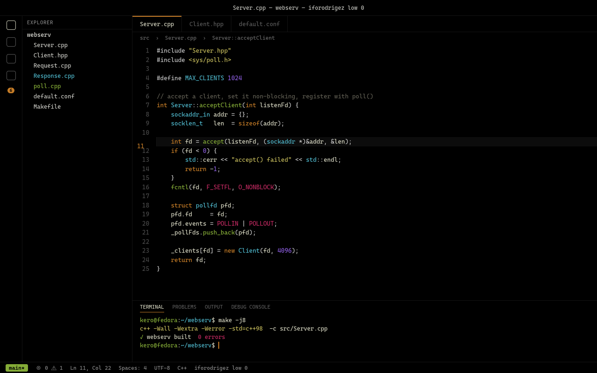
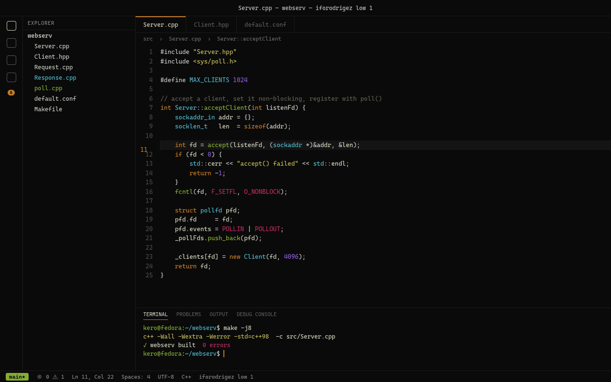
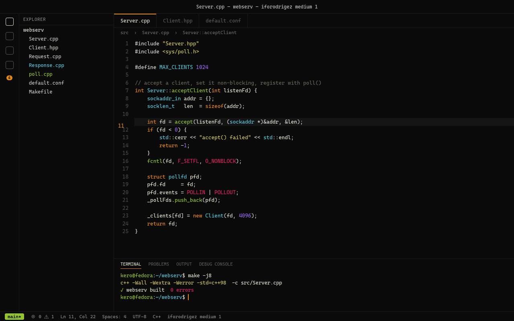
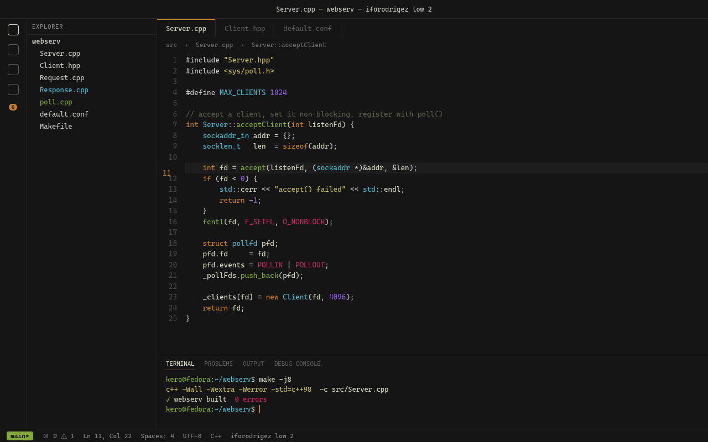

# iforodrigez

A dark VS Code theme where the UI chrome gets out of the way: no gradients, no tinted panels, one accent color.

Twelve variants on two axes. **Ink** is how loud the syntax colors are — `low`, `medium`, `high`. **Background** is how dark the surfaces sit — `0` is pitch black, `3` is the gray VS Code ships with. Pick a cell:

| | low | medium | high |
|---|---|---|---|
| **0** &nbsp;`#000000` | [](images/low0.png) | [](images/medium0.png) | [](images/high0.png) |
| **1** &nbsp;`#0A0A0A` | [](images/low1.png) | [](images/medium1.png) | [](images/high1.png) |
| **2** &nbsp;`#151515` | [](images/low2.png) | [](images/medium2.png) | [](images/high2.png) |
| **3** &nbsp;`#1F1F1F` | [](images/low3.png) | [](images/medium3.png) | [](images/high3.png) |

Click any cell for the full-size shot. The two axes are independent — moving along one never touches the other.

## Ink

| Token | low | medium | high |
|---|---|---|---|
| foreground | `#D6D6C1` | `#E5E5D4` | `#F8F8F2` |
| keyword | `#C57C27` | `#E4881C` | `#FD971F` |
| string | `#C4BA5B` | `#D3C864` | `#E6DB74` |
| function | `#84AB37` | `#93C430` | `#A6E22E` |
| type, class | `#4FB8CC` | `#58C6DB` | `#66D9EF` |
| number | `#8D5EE0` | `#9A6BEF` | `#AE81FF` |
| macro | `#C42A62` | `#E02267` | `#F92672` |
| comment | `#5E5C51` | `#676457` | `#75715E` |

`high` is full saturation. `medium` drops saturation 20% and lightness 10%; `low` drops them 32% and 17%. The accent — cursor, active tab border, badges, buttons, focus ring — is the keyword color of the level you picked.

## Background

| Surface | 0 | 1 | 2 | 3 |
|---|---|---|---|---|
| editor, sidebar, tabs, panel, terminal | `#000000` | `#0A0A0A` | `#151515` | `#1F1F1F` |
| popups, dropdowns, suggest widget | `#0B0B0B` | `#131313` | `#1C1C1C` | `#252525` |
| borders | `#141414` | `#1B1B1B` | `#222222` | `#292929` |

Every neutral surface moves together — editor, sidebar, popups, borders, hover and selection bands — so layer separation survives instead of flattening into one gray. Popups always sit one step above their surroundings, which is what keeps a dropdown reading as a floating thing rather than a hole. Lighter greys move less than dark ones, so line numbers and dimmed text stay readable at every level.

## Install

Grab the `.vsix` from [Releases](https://github.com/ifrankerem/vscode-themes/releases) and install it:

```sh
code --install-extension iforodrigez-theme-1.3.0.vsix
```

If you use VS Code profiles, install into each profile explicitly. A theme registered globally will **not** appear in a profile's theme picker:

```sh
code --install-extension iforodrigez-theme-1.3.0.vsix --profile <profile-name>
```

Then `Ctrl+K Ctrl+T` and pick a variant.

## Editing

Colors live in `themes/iforodrigez-<ink><level>-color-theme.json`. Save and run **Developer: Reload Window** to see changes.

`generate-previews.py` rebuilds the screenshots above straight from the theme files, so a color change can be re-rendered rather than re-shot. It reads the variant list out of `package.json`, so adding a variant needs no edit there:

```sh
python3 generate-previews.py
firefox --headless --screenshot images/low0.png --window-size=1280,800 file://$PWD/iforodrigez-low-0.html
```
