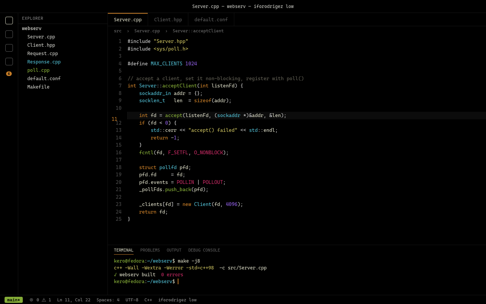
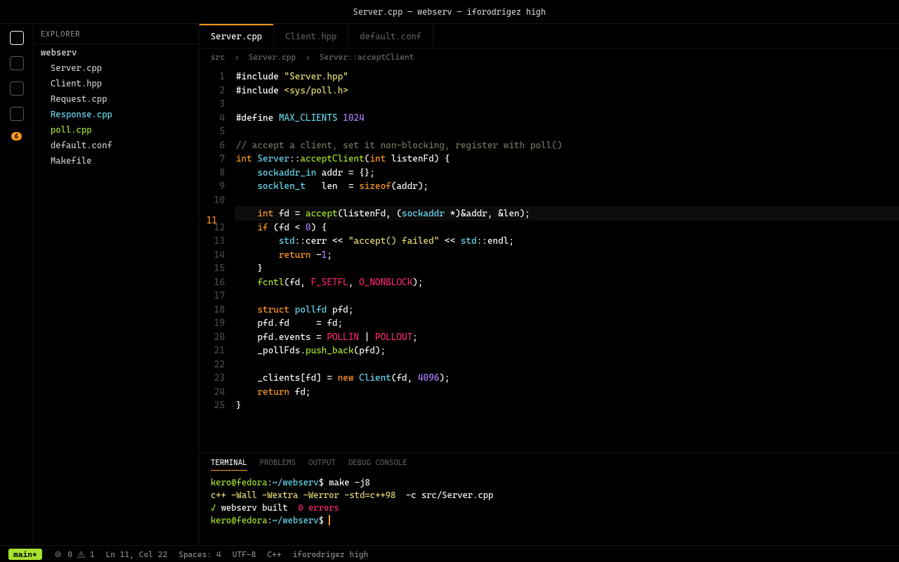

# iforodrigez

A pitch black VS Code theme with Monokai syntax colors, in three saturation levels.

The UI chrome is true black (`#000000`) everywhere — editor, sidebar, tabs, panel, terminal, status bar. Only popups and dropdowns sit one step above (`#0B0B0B`) so they still read as floating layers. The three variants differ **only** in how loud the syntax colors are; the chrome is identical across all of them.

## low

Saturation −32%, lightness −17%. Easiest on the eyes on a black background.



## medium

Saturation −20%, lightness −10%.


## high

Original Monokai punch.



## Palette

| Token | low | medium | high |
|---|---|---|---|
| foreground | `#D6D6C1` | `#E5E5D4` | `#F8F8F2` |
| keyword | `#C57C27` | `#E4881C` | `#FD971F` |
| string | `#C4BA5B` | `#D3C864` | `#E6DB74` |
| function | `#84AB37` | `#93C430` | `#A6E22E` |
| type, class | `#4FB8CC` | `#58C6DB` | `#66D9EF` |
| number | `#8D5EE0` | `#9A6BEF` | `#AE81FF` |
| macro | `#C42A62` | `#E02267` | `#F92672` |
| comment | `#5E5C51` | `#676457` | `#75715E` |

Accent (cursor, active tab border, badges, buttons) is the keyword orange of each level.

## Install

Clone into your extensions folder and reload the window:

```sh
git clone https://github.com/ifrankerem/vscode-themes.git \
  ~/.vscode/extensions/kero.iforodrigez-theme-1.1.0
```

Then `Ctrl+K Ctrl+T` and pick **iforodrigez low / medium / high**.

If you use VS Code profiles, install into each profile explicitly — a theme registered globally will not show up in a profile's theme picker:

```sh
code --install-extension iforodrigez-theme-1.1.0.vsix --profile <profile-name>
```

## Editing

Colors live in `themes/iforodrigez-<level>-color-theme.json`. Save and run **Developer: Reload Window** to see changes.

`generate-previews.py` rebuilds the screenshots above from the theme files, so a color change can be re-rendered rather than re-shot:

```sh
python3 generate-previews.py
firefox --headless --screenshot images/low.png --window-size=1280,800 file://$PWD/iforodrigez-low.html
```
